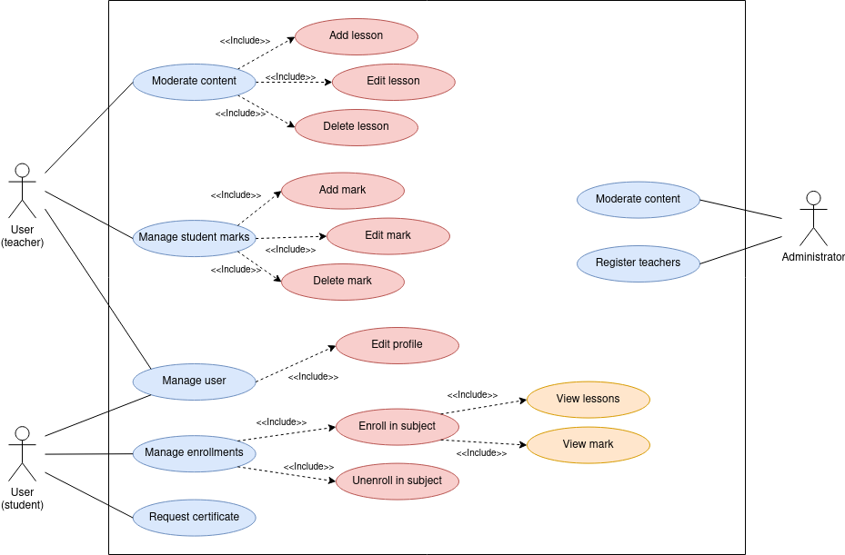

# **Requisitos del proyecto**

<div align="center">
   
</div>

## **Requisitos funcionales**

Para poder ejecutar **Lumino**, es necesario contar con **Django**, por lo que primero es preciso instalar **Python** en el sistema. Además, la plataforma requiere varias librerías y dependencias que deben ser instaladas para asegurar su correcto funcionamiento. A continuación, se detallan las dependencias necesarias:

- **Django**: Framework principal para el desarrollo del proyecto.
- **Pillow**: Biblioteca para la manipulación de imágenes.
- **IPython**: Herramienta interactiva para ejecutar código Python en entornos de desarrollo.
- **crispy-bootstrap5**: Extensión para utilizar Bootstrap 5 en las plantillas de Django.
- **django-browser-reload**: Herramienta para recargar automáticamente el navegador durante el desarrollo.
- **django-markdownify**: Convertidor de Markdown a HTML para el manejo de contenido en formato Markdown.
- **sorl-thumbnail**: Generación y almacenamiento de miniaturas de imágenes.
- **weasyprint**: Librería para generar documentos PDF a partir de HTML y CSS.
- **django-rq**: Integración de **RQ (Redis Queue)** con Django para realizar tareas en segundo plano.
- **prettyconf**: Librería para cargar datos confidenciales de forma segura a través del uso de ficheros.

Para instalar todas las dependencias mencionadas, se recomienda instalarlas a través del fichero `requirements.txt` a través del siguiente comando:

```bash
pip install -r requirements.txt
```

Este comando instalará todas las librerías necesarias para ejecutar **Lumino** de manera correcta.

## **Restricciones**

### Técnicas
   - **Compatibilidad de navegadores**: La plataforma debe ser compatible con los principales navegadores web (Chrome, Firefox, Safari, Edge). Sin embargo, puede haber limitaciones en versiones antiguas de algunos navegadores.
   - **Conectividad a Internet**: Requiere una conexión a Internet estable para acceder a la plataforma y sus funciones de manera óptima.
   - **Escalabilidad del sistema**: Aunque el sistema está diseñado para manejar un volumen moderado de usuarios, la carga de usuarios masivos podría requerir ajustes en la infraestructura para garantizar el rendimiento continuo.

### Legales
   - **Protección de datos personales**: La plataforma debe cumplir con las normativas de protección de datos personales, como el **GDPR** en Europa o **Ley de Protección de Datos Personales** en otros países. Esto implica restricciones en el manejo y almacenamiento de la información de los estudiantes y profesores.
   - **Accesibilidad**: Lumino debe cumplir con las normativas de accesibilidad web (como WCAG) para asegurar que sea utilizable por personas con discapacidades, lo que puede limitar ciertos diseños o características.

### De Negocio
   - **Presupuesto y recursos limitados**: Los recursos disponibles para el desarrollo y mantenimiento de la plataforma pueden restringir la velocidad con la que se pueden agregar nuevas funcionalidades o realizar mejoras significativas.
   - **Mercado objetivo**: La plataforma está enfocada principalmente en instituciones educativas, lo que limita la adaptación de la plataforma a otros tipos de usuarios o sectores fuera del ámbito académico.

## **Casos de uso**

A continuación, se presenta un diagrama de casos de uso que muestra de forma visual cómo los usuarios interactúan con el sistema, destacando las principales funciones que pueden realizar.

<div align=center>
    
</div>
