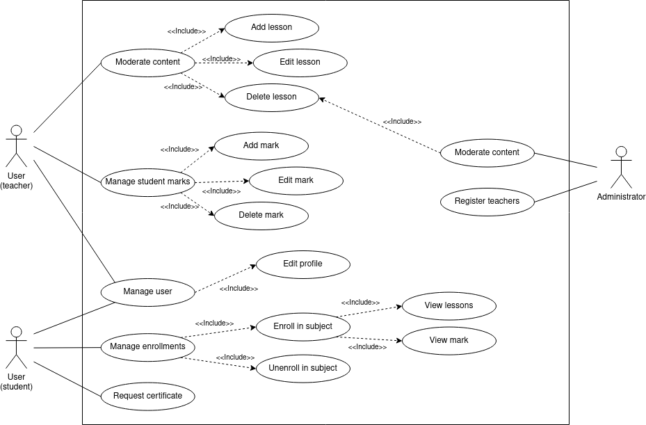

# Requisitos del proyecto

## Requisitos funcionales: Funcionalidades clave que el sistema debe cumplir.

## Requisitos no funcionales: Rendimiento, seguridad, escalabilidad, usabilidad, etc.

## Restricciones: Factores técnicos, legales o de negocio que afectan el desarrollo.

## Casos de uso

A continuación, se presenta un diagrama de casos de uso que muestra de forma visual cómo los usuarios interactúan con el sistema, destacando las principales funciones que pueden realizar.

    

