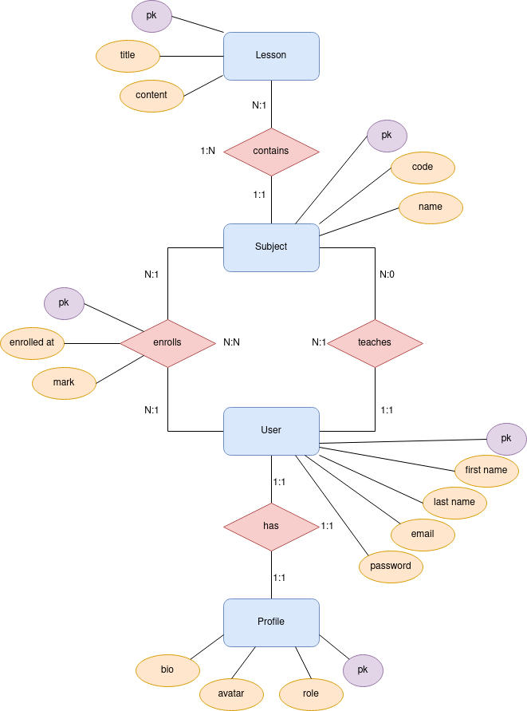
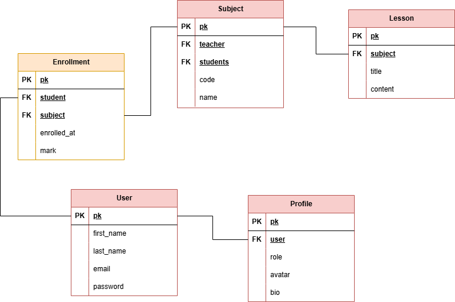

# Diseño del sistema

## Arquitectura del sistema: Diagrama y descripción de los componentes principales.

## Modelo de datos

**Modelo entidad-relación:** utilizado para representar de manera gráfica y conceptual la estructura de una base de datos, definiendo las entidades, atributos y relaciones entre ellas.

    

 

**Modelo relacional:** sirve para organizar la información en tablas, como una hoja de cálculo, donde cada fila es un dato específico y cada columna describe sus características.

    

## Diagramas: Diagramas de clases, de secuencia, de actividades...

## Decisiones de diseño: Justificación de las tecnologías, patrones y enfoques elegidos.
